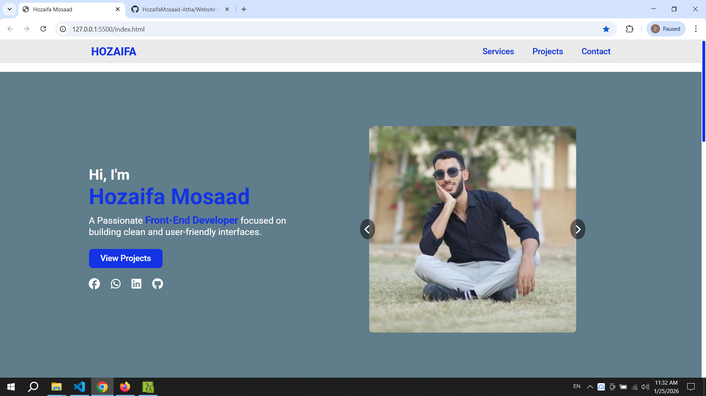

# Website Houzifa Mosaad

A professional, fully responsive web project built with modern technologies focusing on performance and user experience.

## 🛠️ Tech Stack
* **HTML5:** Semantic structure.
* **SCSS (Sass):** Advanced styling using variables, nesting, and modular architecture.
* **TypeScript (TS):** Robust logic for interactive components and type safety.

## ✨ Features
* **Fully Responsive:** Optimized for all screen sizes (Mobile, Tablet, and Desktop).
* **Smart Image Slider:** Automated sliding with manual controls and intelligent `clearInterval` on user interaction.
* **Dynamic Back-to-Top:** Scroll-triggered navigation button for better UX.
* **Custom Scrollbar:** Branded and styled scrollbar using SCSS.

## 📸 Project Preview



## 🚀 Installation & Setup
1. Clone the repository:
   ```bash
   git clone [[https://github.com/Houzifa-Mosaad/Website-Houzifa-Mosaad.git](https://github.com/HozaifaMosaad-Attia/Website-Houzifa-Mosaad.git)]
